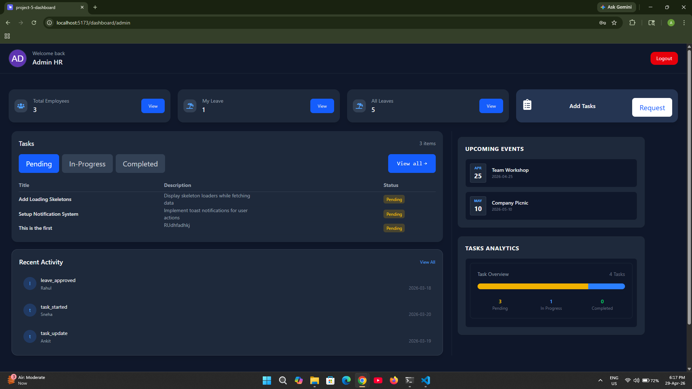
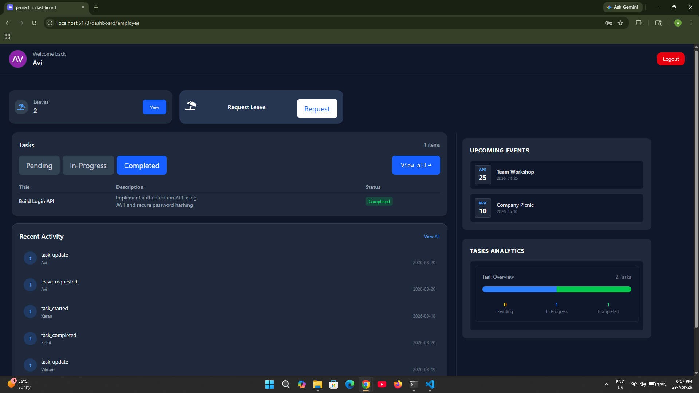

# 🧑‍💼 Admin–Employee Dashboard

A role-based dashboard built with React that simulates admin and employee workflows using static data. The project focuses on frontend architecture, route protection, and state management using Context API.

---

## 📸 Screenshots




---

## 🚀 Live Demo

https://admin-employee-dashboard-gold.vercel.app/

---

##  Demo Credentials

### Admin

Email: eng.admin@mail.com
Password: 123

### Employee

Email: avi@mail.com
Password: 123

---

## 🧠 Overview

* Simulated login using predefined users
* Role-based dashboards (Admin / Employee)
* Protected routes using React Router
* Global state management using Context API
* Session persistence with LocalStorage

---

##  Features

### Authentication (Simulated)

* Login with static user data
* Role stored in LocalStorage
* Global auth state using Context API

### Role-Based Access

* Separate Admin and Employee dashboards
* Route protection and redirects

### Admin Dashboard

* View employee-related static data

### Employee Dashboard

* View assigned static data

---

##  Tech Stack

* React
* TypeScript
* React Router
* Context API
* LocalStorage                                                      
* Tanstack Query
---

##  Installation & Setup

```bash
git clone https://github.com/Avinash-kumar-0690/Admin-Employee-Dashboard.git
cd Admin-Employee-Dashboard
npm install
npm run dev
```


##  How It Works

1. User logs in with predefined credentials
2. User data is stored in LocalStorage
3. Auth state is managed globally using Context API
4. Routes are protected based on user role

---

##  Limitations

* No backend or database
* No real authentication (no API / JWT)
* Data is static
* No CRUD functionality

---

##  Future Improvements

* Add backend (Node.js / Express)
* Replace static data with API
* Implement JWT authentication
* Add CRUD operations

---

##  Author
Autho : Avinash Kumar Bind (self-taught)
